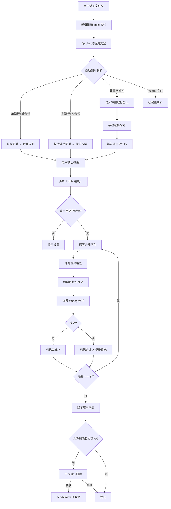

# Fisheep Video Merger — 完整实施计划

## 仓库信息
- 远程仓库：`https://github.com/chycycc/fisheep-video-merger.git`
- 分支策略：`main`（稳定版）+ `dev`（日常开发）
- 版本号：`v0.1.0`（开发中）

---

## 阶段一：项目初始化与环境搭建

### 1.1 创建项目基础文件
- [ ] 根目录创建 `.gitignore`
- [ ] 创建 `.vscode/settings.json`
- [ ] 创建 `.vscode/launch.json`
- [ ] 根目录创建 `requirements.txt`（初始：PySide6>=6.5, send2trash）
- [ ] 创建 `src/fisheep_video_merger/__init__.py`（含 `__version__ = "0.1.0"`）
- [ ] 创建 `src/fisheep_video_merger/main.py`（空入口文件，仅 `if __name__ == "__main__": pass`）
- [ ] 根目录创建 `README.md`

### 1.2 虚拟环境与依赖
- [ ] 创建虚拟环境：`python -m venv venv`
- [ ] 激活虚拟环境：`venv\Scripts\activate`
- [ ] 安装依赖：`pip install -r requirements.txt`
- [ ] 锁定版本：`pip freeze > requirements.txt`

### 1.3 Git 初始化
- [ ] `git init`
- [ ] `git checkout -b dev`
- [ ] `git add .`
- [ ] `git commit -m "chore: 初始化项目结构与配置"`
- [ ] `git remote add origin https://github.com/chycycc/fisheep-video-merger.git`
- [ ] `git push -u origin dev`

### 1.4 验证环境
- [ ] 运行 `python src/fisheep_video_merger/main.py` 确认无报错
- [ ] 运行 `ffmpeg -version` 确认 ffmpeg 可用

---

## 阶段二：核心工具函数开发

### 2.1 项目结构规划
```
src/fisheep_video_merger/
├── __init__.py              # 版本信息
├── main.py                  # 程序入口
├── core/                    # 核心逻辑
│   ├── __init__.py
│   ├── scanner.py           # 文件扫描 + ffprobe 分析
│   ├── matcher.py           # 自动配对逻辑
│   ├── merger.py            # ffmpeg 合并引擎
│   └── path_utils.py        # 路径镜像与深度裁剪
├── ui/                      # 界面层
│   ├── __init__.py
│   ├── main_window.py       # 主窗口
│   ├── merge_queue_tab.py   # 合并队列标签页
│   ├── pending_tab.py       # 待整理标签页
│   ├── settings_panel.py    # 右侧设置面板
│   └── dialogs.py           # 各种对话框
└── utils/                   # 工具函数
    ├── __init__.py
    ├── ffprobe.py           # ffprobe JSON 解析封装
    └── logger.py            # 日志记录
```

### 2.2 开发核心模块
- [ ] **`utils/ffprobe.py`**：封装 ffprobe 调用，解析 JSON，返回流类型（video_only / audio_only / muxed）
- [ ] **`utils/logger.py`**：内存日志 + 文件日志，支持错误记录
- [ ] **`core/scanner.py`**：递归扫描目录收集 .m4s 文件，调用 ffprobe 分析每个文件
- [ ] **`core/matcher.py`**：自动配对逻辑（单对/多对/数量不对等），返回配对结果和剩余零散文件
- [ ] **`core/path_utils.py`**：路径镜像计算、深度裁剪算法、输出路径生成
- [ ] **`core/merger.py`**：ffmpeg 命令组装、子进程执行、返回码判断、重名处理

---

## 阶段三：UI 界面骨架开发

### 3.1 基础界面
- [ ] **`ui/main_window.py`**：主窗口（1100x700，可缩放），整体布局（顶部工具栏 + 左右分栏 + 底部状态栏）
- [ ] **`ui/settings_panel.py`**：右侧设置面板（输出格式下拉框、输出目录+浏览、路径深度、删除选项、开始合并按钮）
- [ ] **`ui/merge_queue_tab.py`**：合并队列表格（状态/输出名/视频源/音频源/输出路径）
- [ ] **`ui/pending_tab.py`**：待整理表格（类型/文件名/所在文件夹）
- [ ] **`ui/dialogs.py`**：批量命名对话框、重名处理对话框、删除确认对话框、结果摘要对话框

### 3.2 主程序入口
- [ ] **`main.py`**：初始化 QApplication，创建主窗口，ffmpeg 可用性检测

---

## 阶段四：交互功能开发

### 4.1 文件添加与扫描
- [ ] 实现「添加文件夹」按钮 → QFileDialog → 递归扫描
- [ ] 实现文件夹拖拽添加（Drag & Drop）
- [ ] 扫描进度反馈（状态栏文本更新）
- [ ] 扫描完成后自动填充「合并队列」和「待整理」标签页

### 4.2 配对交互
- [ ] 待整理列表多选（Ctrl/Shift）
- [ ] 右键菜单「配对所选」→ 弹出命名输入框 → 移入合并队列
- [ ] 合并队列中双击单元格编辑输出文件名
- [ ] 批量命名：多选任务 → 右键「批量命名」→ 前缀+起始序号+位数

### 4.3 其他交互
- [ ] 右键「预览」→ `os.startfile()` 调用系统播放器
- [ ] 右键「移除任务」→ 从合并队列移除
- [ ] 「清空列表」按钮 → 重置所有状态
- [ ] 已完整文件（muxed）的转封装功能
- [ ] 路径深度实时预览示例更新

---

## 阶段五：合并引擎开发

### 5.1 合并执行
- [ ] 「开始合并」按钮逻辑：检查输出目录 → 遍历队列 → 调用 ffmpeg
- [ ] 进度条更新（完成任务数/总任务数）
- [ ] 底部状态文本实时显示当前任务
- [ ] 单任务失败不影响后续（记录错误，标记红色状态）

### 5.2 后处理
- [ ] 合并完成 → 结果摘要弹窗（成功X/失败Y）
- [ ] 重名处理对话框（覆盖/重命名/跳过，可应用到全部）
- [ ] 删除源文件二次确认 → send2trash 移至回收站

---

## 阶段六：测试与优化

### 6.1 测试场景
- [ ] 单文件夹单对（最常见情况）
- [ ] 多文件夹批量扫描
- [ ] 多对文件（2视频+2音频）自动配对
- [ ] 数量不对等（2视频+1音频）→ 进入待整理
- [ ] muxed 文件跳过 + 转封装
- [ ] 手动配对 + 批量命名
- [ ] 路径深度 0/1/2 各测试
- [ ] 输出文件重名处理
- [ ] ffmpeg 不可用时的警告
- [ ] 合并失败场景

### 6.2 优化
- [ ] 扫描大目录时的性能（考虑多线程）
- [ ] UI 响应流畅度

---

## 阶段七：打包

### 7.1 PyInstaller 打包
- [ ] 安装 PyInstaller
- [ ] 编写打包脚本或 spec 文件
- [ ] 生成单文件 exe
- [ ] 测试 exe 在无 Python 环境的机器上运行

---

## 流程图



---

## 提交规范

```
feat: 新功能
fix: 修复
refactor: 重构
docs: 文档
style: 格式
test: 测试
chore: 构建/工具变更
```

示例：
```
chore: 初始化项目结构与配置
feat: 实现 ffprobe 流类型分析
feat: 添加配对队列界面
fix: 修正路径深度裁剪边界情况
```
