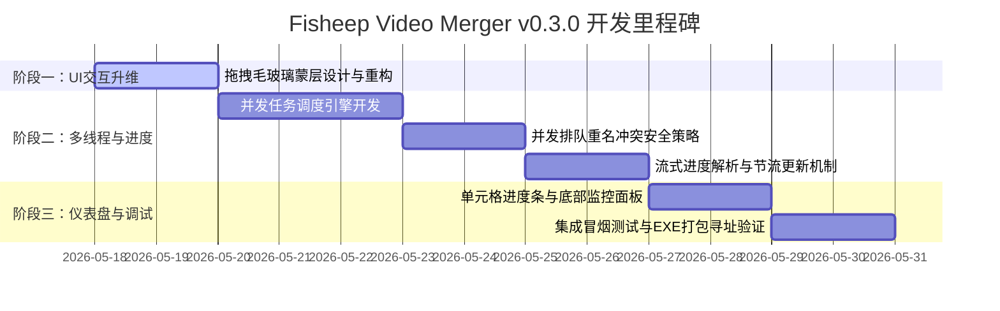

# 🐑 Fisheep Video Merger — v0.3.0 实施计划

## 仓库信息
- **当前版本**：`v0.2.0` (最新稳定版)
- **目标版本**：`v0.3.0`
- **迭代重心**：多线程并发合并、流式进度与 ETA 仪表盘、多目录拖拽蒙层与 UI 交互体验升维

---

## 💎 一、 v0.3.0 核心特性交互与架构设计

### 1. 特性一：多线程并发合并引擎 (Multi-threaded Concurrent Merge Engine)
*   **交互逻辑**：
    *   在右侧设置面板增加「并发任务数」微调器 (`QSpinBox`)，支持 `1 - 4` 个并发通道。
    *   点击「开始合并」，系统根据设置的并发数启动任务队列。表格中的状态列从等待 `⏳` 瞬间流转为对应的多线程合并状态。
*   **架构设计**：
    *   引入 `QThreadPool` 或自定义线程安全的任务调度器（以 `QRunnable` 或带有同步事件锁的 `threading.Event` 实现）。
    *   **重名冲突排队机制**：解决高并发下多个子线程同时触发冲突对话框导致弹窗重叠、主线程死锁的致命隐患。各子线程在发现文件重名时，不直接弹窗，而是通过 Signal 将冲突事件派发给主线程的“弹窗缓冲池”。主线程通过互斥锁排队展示 `ConflictDialog`，处理完毕后通过事件（`threading.Event`）唤醒挂起的合并子线程。

### 2. 特性二：毫秒级任务流式进度与预计剩余时间 (ETA) 看板 (Real-time Progress & ETA Dashboard)
*   **交互逻辑**：
    *   **单元格嵌入进度条**：合并队列中的每一行在执行时，其「状态」列将动态渲染为一个微型进度条（`QProgressBar`），直观呈现当前文件的实际合并百分比。
    *   **底部并发状态仪表盘**：在主界面底部，原先单一的进度条上方，升起一个高度集成的「并发运行监视看板」（`QScrollArea` 容纳的动态流式布局）。每个正在运行的并发任务拥有一张独立的“线程卡片”（显示输出文件名、当前速率、剩余时间 ETA、以及高精度百分比进度）。
*   **架构设计**：
    *   **高频渲染防抖与节流**：FFmpeg stderr 产生 `time=` 进度数据的频率极高（每秒 10-20 次）。多线程高频投递信号会直接阻塞 PyQt 界面事件循环。在 `_run_ffmpeg_with_progress` 中引入节流锁：每隔 `150ms` 且百分比变化大于 `0.5%` 时，才向主线程发射刷新信号；主线程更新 Table 单元格时，只针对数据有实质性改变的 Widget 触发重绘。

### 3. 特性三：多目录并行拖入与毛玻璃拖拽蒙层交互 (Drop Zone Overlay & Multi-directory Drag-in)
*   **交互逻辑**：
    *   当鼠标拖拽文件夹或 `.m4s` 文件移入主窗口的任意区域时，主窗口瞬间虚化，平滑淡入一层半透明的毛玻璃质感蒙层 (`Glassmorphism Overlay`)，居中显示 `🐑 释放鼠标，立即导入视频合并任务` 的引导动画与发光虚线框。
    *   鼠标释放后，蒙层平滑淡出，主界面无缝恢复，左下角状态栏亮起旋转加载标，后台增量并行扫描，解析完毕后列表行伴随轻微滑动淡入。
*   **架构设计**：
    *   编写一个全局的 `DropOverlay` 遮罩控件（继承自 `QWidget`），常态下通过 `hide()` 隐藏，并在 `dragEnterEvent` / `dragMoveEvent` 被触发时铺满主窗口，在 `dragLeaveEvent` / `dropEvent` 被触发时淡出。
    *   重构 `scan_multiple_directories` 的多目录并行扫描，引入 `QRunnable` 线程池增量搜寻，利用增量刷新机制，确保大目录导入时界面完全不卡顿。

---

## 📊 二、 v0.3.0 优先级与开发阶段划分

---

## 📜 三、 结构化实施任务清单 (Checklist)

### 阶段一：多目录并行拖入与毛玻璃拖拽蒙层交付

#### 1.1 毛玻璃拖拽蒙层控件设计与全域捕获
- [x] **研发步骤**：
  1. 在 `src/fisheep_video_merger/ui/widgets/`（或直接在 `ui` 目录下）新建 `drop_overlay.py`，编写 `DropOverlay` 遮罩控件。
  2. 使用 QSS 调配半透明微光毛玻璃滤镜（`background-color: rgba(30, 30, 40, 180); border: 2px dashed #4CAF50;`），居中放置 `QLabel` 用于绘制羊驼 🐑 与提示词。
  3. 在 `MainWindow` 的 `_setup_ui` 尾部实例化 `DropOverlay`，使其作为 `MainWindow` 的子控件。利用 `resizeEvent` 动态跟随主窗口大小缩放。
  4. 拦截并重写 `MainWindow` 的 `dragEnterEvent`，若带有合法 URL，展示 `DropOverlay` 并将其置顶（`raise_()`）。
  5. 拦截 `dragLeaveEvent`，平滑淡出蒙层。
- [x] **验收标准**：
  *   **前端 UI**：拖入文件夹或文件时，主界面 100% 覆盖遮罩，文字清晰，背景有柔和的高级科技透感，虚线框边缘呼吸发光；鼠标离开窗口边缘时，遮罩秒级自然退场。
  *   **后端逻辑**：拖入判定严密，非本地文件拖入不激活遮罩，不干扰主界面常规事件。

#### 1.2 多目录增量无阻塞扫描引擎
- [x] **研发步骤**：
  1. 重写 `dropEvent`，识别多目录并剥离出所有 `.m4s` 文件，防止同步卡死。
  2. 优化 `scanner.py` 中的扫描线程设计。使用 `QThreadPool` 将不同目录的扫描任务分发给不同的工作线程，并行扫描各子目录。
  3. 使用信号增量投递扫描结果。每扫描完一个目录，立即向主线程发射增量结果信号，不再等待所有目录扫描完成才统一渲染。
- [x] **验收标准**：
  *   **前端 UI**：拖入多个庞大目录时，主界面不产生哪怕 1 帧的假死，底部状态栏显示旋转加载 Spinner 且数量实时滚动递增。
  *   **后端逻辑**：支持同时拖入 10 个以上不同位置的 B站缓存目录，无漏扫、无重复任务挂载，内存不出现阶跃。

---

### 阶段二：多线程并发合并引擎交付

#### 2.1 QThreadPool 并发任务调度器
- [x] **研发步骤**：
  1. 在 `core/merger.py` 中，重构单任务执行机制，新建 `MergeWorker` 继承自 `QRunnable`，重写其 `run` 方法。
  2. 在 `MainWindow` 中声明 `QThreadPool`，在设置面板读取并发数 `max_concurrency`（绑定至 `thread_pool.setMaxThreadCount(val)`）。
  3. 点击合并时，实例化多个 `MergeWorker` 并送入线程池，由 Qt 自动根据最大并发限制排队流转。
- [x] **验收标准**：
  *   **前端 UI**：设置并发为 3 时，点击合并，合并队列中前 3 个勾选的任务同时进入运行态，界面不卡死。
  *   **后端逻辑**：多任务后台并行运行，底层 FFmpeg 各自拉起子进程，合并文件完美，没有因争抢 CPU / 磁盘 I/O 导致的任务崩溃。

#### 2.2 线程安全的重名冲突排队缓冲池
- [x] **研发步骤**：
  1. 在 `MergeWorker` 执行前，检查 `actual_path` 是否已存在。若存在，向主线程发射 `conflict_signal`，并调用 `threading.Event().wait()` 挂起该子线程。
  2. 主线程建立 `conflict_queue`。当接收到子线程的冲突信号时，将其推入冲突排队队列。
  3. 主线程从队列中逐个取出冲突任务，弹出汉化版 `ConflictDialog`。
  4. 用户做出策略决策（覆盖/重命名/跳过，支持“应用到全部”）后，将结果写入该子线程的专属缓存，并调用 `event.set()` 唤醒子线程继续往下执行。
- [x] **验收标准**：
  *   **前端 UI**：同时有 3 个任务冲突时，UI 绝不产生重叠弹窗，而是依次排队优雅弹出；若用户勾选“应用到全部”，后续冲突被智能秒级代刷，不弹出扰民。
  *   **后端逻辑**：多线程唤醒与挂起状态完全隔离，子线程在等待用户决策时 0% 占用 CPU，挂起与唤醒逻辑无死锁。

---

### 阶段三：毫秒级任务流式进度与预计剩余时间 (ETA) 仪表盘交付

#### 3.1 FFmpeg stderr 节流解析与高频防抖投递
- [x] **研发步骤**：
  1. 优化 `_run_ffmpeg_with_progress` 流式逐字读取逻辑。
  2. 在子线程增加状态数据包：`{task_index, percentage, speed, eta}`。
  3. 引入时间节流锁：声明 `last_emit_time`，每次向主线程发射信号前，检查与上次发射的毫秒差。如果小于 `150ms` 且百分比增长未跨越 `1%`，则仅更新子线程状态字典，不发射信号，完成极致的防抖节流。
- [x] **验收标准**：
  *   **后端逻辑**：高频流式解析完全非阻塞，数据计算绝对精准，防抖锁控制信号发射频率在 `5Hz - 7Hz` 之间，完美抹平高频开销。

#### 3.2 单元格嵌入进度条与底部运行监视卡片 (Dashboard)
- [x] **研发步骤**：
  1. 在 `MergeQueueTab` 的表格中，当任务转入运行态时，调用 `self.table.setCellWidget(row, COL_STATUS, custom_progress_widget)`，用高颜值的嵌入式微型进度条替换纯文字时钟图标。
  2. 进度条色彩体系跟随当前主题色自适应（明亮模式深绿，夜间模式极客绿）。
  3. 在主界面底部开辟 `ActiveTasksDashboard` 卡片槽。当任务开始时，在卡片槽内平滑伸展出并发卡片，用精致的细长字体渲染：`[进度条 65.2%] 剩余 5秒 | 4.2 MB/s`；当任务合并完成时，该卡片秒级优雅折叠收纳或淡出。
- [x] **验收标准**：
  *   **前端 UI**：表格内进度条渲染丝滑，与当前视觉主题无缝契合，底部卡片布局分明，卡片展现与销毁有轻微平滑过渡，界面刷新 0 抖动，帧率稳健保持在 60 帧。
  *   **开发交付**：代码内对 `setCellWidget` 产生的内存引用有严格的析构管理，任务清空时彻底销毁 Widget，保证 0 内存泄漏。

---

> [!IMPORTANT]
> **EXE 打包防护底线提醒**：
> 在本轮迭代所产出的任何用于文件操作或状态写入的模块（包含新引入的扫描线程池与缓存调度机制），必须严格引入 `sys.frozen` 检测规程，数据存放和历史流水追溯必须无条件寻址至 `sys.executable` 同级目录，严防一切非受控崩溃！
