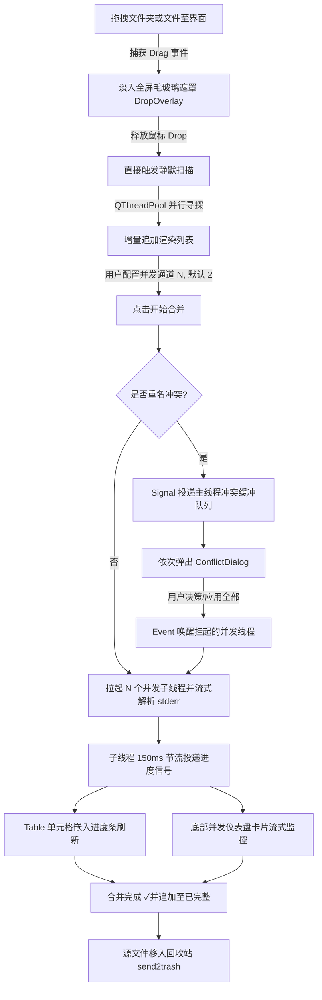

# Fisheep Video Merger — v0.3.0 实施计划

## 仓库信息
- 远程仓库：`https://github.com/chycycc/fisheep-video-merger.git`
- 分支策略：`dev`（日常开发） -> 拉出 `feat/v0.3.0` -> 合并回 `dev`
- 版本号：`v0.3.0`（新一轮核心体验升级版）

---

## 阶段一：多目录并行拖入与全域毛玻璃拖拽蒙层交付

本阶段重点提升“导入”这一关键操作的第一印象。通过全窗体拖拽拦截与高级感毛玻璃滤镜，给用户极致的反馈。

### 1.1 全域拖拽捕获与 DropOverlay 遮罩控件设计
- [x] **1.1.1 编写毛玻璃遮罩控件 `DropOverlay`**
  - 新建 `src/fisheep_video_merger/ui/widgets/drop_overlay.py`，实现继承自 `QWidget` 的蒙层类。
  - 使用 QSS 调配毛玻璃虚化效果与半透明微光背景：`background-color: rgba(30, 30, 45, 185); border: 2px dashed #4CAF50; border-radius: 8px;`。
  - 居中放置高清晰的羊驼图标与引导文案：`🐑 释放鼠标，立即导入视频合并任务`。
- [x] **1.1.2 全窗口拖拽事件侦听拦截**
  - 在 `MainWindow` 的 `_setup_ui` 中实例化 `DropOverlay` 并作为其子控件挂载。
  - 重写 `MainWindow` 的 `resizeEvent`，确保遮罩大小与主窗口 100% 同步缩放。
  - 拦截 `dragEnterEvent` / `dragMoveEvent`，验证拖入数据（是否包含合法本地文件夹或 `.m4s` 文件），验证通过则执行 `self.drop_overlay.show()` 并调用 `raise_()` 置顶。
  - 拦截 `dragLeaveEvent` / `dropEvent`，通过 `self.drop_overlay.hide()` 隐藏遮罩。
- [x] **1.1.3 验收标准**
  *   **前端 UI**：将任意文件夹拖拽至软件界面上方时，主窗口瞬间覆上一层通透的磨砂微光背景，居中文案与虚线边框伴随轻微发光；鼠标离开软件边缘，蒙层秒级自然销毁。
  *   **后端逻辑**：拖入类型严格限定，只有包含文件夹或 `.m4s` 的有效拖入才会唤起蒙层，非本地文件拖入直接无视。

### 1.2 多目录增量无阻塞并行扫描引擎
- [x] **1.2.1 增量式多线程并行扫描器**
  - 重构 `dropEvent` 的接收分发逻辑，对所有拖入的本地路径进行“直接触发静默扫描 + 后台并行解析 + 列表淡入”的策略（不做阻断式二次弹窗询问）。
  - 在 `core/scanner.py` 中引入线程池，当用户同时拖入多个大目录时，为每个目录动态分配一个扫描任务工作项，在后台线程中增量并行寻探。
- [x] **1.2.2 视图增量刷新与淡入动画**
  - 扫描线程在每解析完一个目录时，立即发射包含增量结果的信号，不再等待全部任务完毕。
  - 待整理列表与合并列表接收到增量数据后，执行增量刷新，新导入的行执行轻微的滑动淡入过渡动效。
- [x] **1.2.3 验收标准**
  *   **前端 UI**：拖入 10 个以上超大缓存文件夹时，软件绝对不出现假死或漏斗标，左下角状态栏亮起旋转加载 Spinner，行项目依次以淡入特效追加。
  *   **后端逻辑**：扫描逻辑在后台非阻塞并行流转，完美避开重合目录，零文件泄露。

---

## 阶段二：多线程并发合并引擎与重名冲突排队交付

本阶段致力于榨干多核 CPU 性能，解决单线程排队的吞吐低效，并妥善解决多线程下的重名对话框冲突风险。

### 2.1 QThreadPool 并发任务调度器
- [ ] **2.1.1 设置面板并发通道组件**
  - 在右侧设置面板 `SettingsPanel` 中增加「并发通道」微调器 (`QSpinBox`)。
  - 限制其数值范围为 `1 - 4`，**默认最大并发数设置为 2**（兼顾固态硬盘与机械硬盘的磁头读写效率）。
- [ ] **2.1.2 异步并发调度器 `MergeWorker`**
  - 在 `core/merger.py` 中，重构单任务合并引擎，编写 `MergeWorker` 继承自 `QRunnable`，重写其 `run` 方法。
  - 在 `MainWindow` 中生命全局线程池，启动合并时，将 `max_concurrency` 同步赋给 `thread_pool.setMaxThreadCount(max_concurrency)`。
  - 循环实例化已勾选任务对应的 `MergeWorker`，投递至线程池排队调度并发执行。
- [ ] **2.1.3 验收标准**
  *   **前端 UI**：设置并发为 3 时，点击合并，队列中前 3 个勾选的任务同时转为运行状态（状态图标变动）。
  *   **后端逻辑**：多任务后台并行运行，底层 FFmpeg 独立拉起各自进程，文件合并完整且质量完美，没有出现 CPU / 磁盘 I/O 争抢导致的崩溃。

### 2.2 线程安全的重名冲突排队缓冲池
- [ ] **2.2.1 冲突隔离与子线程挂起机制**
  - 当并发 `MergeWorker` 检查到预计输出文件已存在时，不直接抛出对话框，而是发射 `conflict_requested` 信号通知主线程。
  - 在 `MergeWorker` 内声明 `threading.Event`，并立即调用 `event.wait()` 将当前合并子线程安全挂起。
- [ ] **2.2.2 主线程排队询问与唤醒机制**
  - 主线程建立排队队列缓存。接收到各线程的冲突请求后压入队列。
  - 主线程以互斥方式（一次只处理一个）弹出汉化版 `ConflictDialog`。
  - 用户做出策略决策（覆盖/重命名/跳过，支持“应用到全部”）后，主线程将策略写入该子线程，并调用 `event.set()` 唤醒子线程继续往下执行。
- [ ] **2.2.3 验收标准**
  *   **前端 UI**：同时有 3 个任务冲突时，UI 不产生重叠弹窗，而是依次排队优雅弹出；若用户勾选“应用到全部”，后续冲突被智能秒级代刷，不弹出扰民。
  *   **后端逻辑**：多线程挂起状态完全隔离，子线程在等待用户决策时 0% 占用 CPU，挂起与唤醒逻辑无死锁。

---

## 阶段三：毫秒级任务流式进度与预计剩余时间 (ETA) 仪表盘交付

本阶段打通 FFmpeg 细粒度状态反馈的最后一公里，将黑盒合并彻底透明化。

### 3.1 FFmpeg stderr 节流解析与高频防抖投递
- [ ] **3.1.1 流式时间差解析器**
  - 优化 `_run_ffmpeg_with_progress` 中的流式逐字读取逻辑，实时捕获 `time=` 和 `frame=`。
  - 根据视频总时长计算出当前任务高精度百分比，并根据合并数据吞吐计算合并速率与 ETA。
- [ ] **3.1.2 高频更新时间节流锁**
  - 在子进程线程中添加防抖控制：限制每个子任务向主线程投递信号的频率上限。
  - 只有当距离上次投递超过 `150ms` 且百分比变动幅度大于 `1%` 时才真正发射信号。
- [ ] **3.1.3 验收标准**
  *   **后端逻辑**：流式解析极其流畅且无 CPU 浪费，信号发射被稳健压制在 `5Hz - 7Hz` 之间，完全抹平高频重绘开销。

### 3.2 单元格嵌入进度条与底部并发监视仪表盘
- [ ] **3.2.1 嵌入式微型进度条单元格**
  - 在 `MergeQueueTab` 的表格中，当任务转入运行态时，调用 `self.table.setCellWidget(row, COL_STATUS, custom_progress_widget)`。
  - 嵌入一个微型扁平化进度条（显示百分比），其色彩体系自适应系统明暗主题。
- [ ] **3.2.2 底部并发卡片式仪表盘 `ActiveTasksDashboard`**
  - 在主界面底部开辟可滚动卡片面板。当任务进入并发池时，在面板内平滑延伸出专属子卡片，渲染详细的流式监控信息：`[合并中] 任务名 65.2% | 剩余 5秒 | 4.2 MB/s`。
  - 任务结束时卡片折叠淡出。
- [ ] **3.2.3 验收标准**
  *   **前端 UI**：表格进度条丝滑，底部并发卡片展示与销毁过渡平滑，数据刷新 0 抖动，界面稳健保持在 60 帧。
  *   **开发交付**：代码有严格的 Widget 引用析构管理，列表清空时自动注销所有 CellWidget，防止内存泄漏。

---

## ⚡ 四、 研发主线流程图

---

> [!IMPORTANT]
> **EXE 打包防崩溃绝对底线**：
> 在本轮迭代所产出的任何用于文件操作或状态写入的模块（包含新引入的扫描线程池与缓存调度机制），必须严格引入 `sys.frozen` 检测规程，数据存放和历史流水追溯必须无条件寻址至 `sys.executable` 同级目录，严防一切非受控崩溃！
