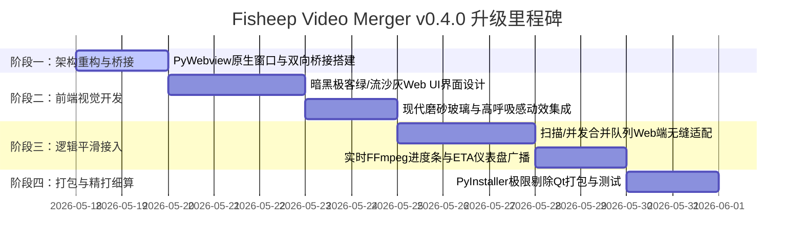

# 🐑 Fisheep Video Merger — v0.4.0 实施计划

## 仓库信息
- **当前版本**：`v0.3.0` (多线程并发合并稳定版)
- **目标版本**：`v0.4.0`
- **迭代重心**：**PySide6 桌面框架全面迁移至 PyWebview 现代 Web 混合架构，引入高品质暗黑科技绿与流沙灰双主题极客视觉，打包体积精简 80%+**

---

## 💎 一、 v0.4.0 核心特性交互与架构设计

为了彻底解决 PySide6 带来的打包体积膨胀（60MB+）和 QSS 样式表对现代动效、玻璃态拟物视觉支持不足的硬伤，v0.4.0 将进行划时代的技术栈升级。

### 1. 特性一：PySide6 彻底重构为 PyWebview 混合架构 (PyWebview Hybrid Architecture)
*   **交互逻辑**：
    *   启动软件时，拉起一个高精细度的原生无边框/带阴影窗口。底层调用系统内置的 Webview 渲染引擎（如 Windows 10/11 的 Edge Webview2 内核），不再捆绑庞大的 Qt 二进制库。
    *   前端使用绝对自由的网页技术渲染，后端依然使用原本 100% 稳定的 Python 并发、扫描与合并引擎，两端通过安全的本地 IPC 信道实时通讯。
*   **架构设计**：
    *   **通信桥梁 (IPC JS-API)**：设计一个 `UIBridge` 类，作为 Python 后端与前端的双向接口。前端通过 `window.pywebview.api.method_name(...)` 以 Promise 异步调用的形式调用后端函数。
    *   **双向进度广播**：由于合并是长耗时任务，后端需要实时向前端广播 FFmpeg 进度数据。我们通过持有的窗口句柄，在 Python 中调用 `window.evaluate_js(f"updateTaskProgress({task_index}, {percent}, '{eta}', '{speed}')")`，完成毫秒级无损的数据下发。

```
+-----------------------------------------------------------------------+
|                       Fisheep Video Merger GUI                        |
|                                                                       |
|  +-----------------------------------------------------------------+  |
|  |              🌐 前端 HTML5 / CSS3 / JavaScript (Web UI)          |  |
|  +-----------------------------------------------------------------+  |
|                                  │                                    |
|              调用 API            │  JS 进度广播                       |
|         (pywebview.api)          ▼ (window.evaluate_js)               |
|  +-----------------------------------------------------------------+  |
|  |             🐍 Python 桥接层 (UIBridge - pywebview)              |  |
|  +-----------------------------------------------------------------+  |
|                                  │                                    |
|  +-------------------------------+---------------------------------+  |
|  |  扫描引擎 (scanner.py)  | 并发线程池 (QThreadPool) | FFmpeg 驱动  |  |
|  +-----------------------------------------------------------------+  |
+-----------------------------------------------------------------------+
```

### 2. 特性二：暗黑极客绿 & 高级流沙灰双主题现代视觉 (Dark/Light Dual Geek Theme)
*   **交互逻辑**：
    *   **暗黑科技绿模式（默认）**：以 `#0D0E15` 极深星空黑为窗口底色，辅以微弱透明的面板（`rgba(21, 22, 33, 0.85)`）形成错落层次。高亮色采用呼吸发光的**羊驼绿（#10B981）**与聚焦蓝。
    *   **流沙灰明亮模式**：以 `#F8FAFC` 极净流沙灰为底色，卡片采用纯白阴影盒子，高亮色为森林深翠绿。
    *   **极致网页微动效**：按钮配备微妙的弹性缩放（`scale(0.98)`）；复选框与下拉菜单在激活时拥有漂亮的边框渐变延时扩散；表格在拖拽选定时高亮闪烁，整体极具呼吸感。
*   **架构设计**：
    *   利用原生的 CSS 变量（CSS Variables）来管理所有的色彩、圆角与阴影标记，通过在 `<html>` 标签上切换 `data-theme="dark"` 或 `data-theme="light"` 来完成毫秒级的全局视觉切换，100% 告别 PySide 繁琐的 Palette 和 unpolish/polish 重绘痛点。

### 3. 特性三：基于系统 WebView2 的极致体积压缩 (Ultra-lightweight Packaging)
*   **交付目标**：
    *   打包体积从原先 PySide6 的 **60MB~80MB** 直接狂降至 **10MB 左右**。
    *   软件运行冷启动时间缩短 50% 以上，主程序常驻内存（RAM）仅消耗 **20MB~40MB**，极其轻量！
*   **架构设计**：
    *   由于去除了庞大的 Qt GUI 库，Python 代码仅需导入基本的内置库和 `pywebview` 包。使用 PyInstaller 打包时，使用 `--exclude-module` 机制彻底排除 Qt 相关依赖，实现极限精简。

---

## 📊 二、 v0.4.0 开发里程碑



---

## 📜 三、 结构化实施任务清单 (Checklist)

### 阶段一：PyWebview 容器与 JS-Python 双向通信桥搭建

#### 1.1 替换底层 GUI 引擎，构建无边框系统窗口
- [ ] **研发步骤**：
  1. 移除 `requirements.txt` 中的 `PySide6`（或保留作为旧版备份，但主程序不再导入）。
  2. 新增并安装依赖 `pywebview`。
  3. 修改项目主入口 `main.py`（或新建入口），调用 `webview.create_window` 初始化主窗口，启用 `easy_drag` 或自定义窗口拖拽区，确保界面精致度。
  4. 窗口默认加载 `src/fisheep_video_merger/ui/web/index.html`。
- [ ] **验收标准**：
  *   **启动速度**：运行启动命令，窗口秒级拉起，无任何 PySide/Qt 的加载卡顿。
  *   **无缝兼容**：在 Windows 10/11 上能完美调起系统的 Webview2 渲染。

#### 1.2 高安全、低开销 of 本地 JS-API IPC 通信桥
- [ ] **研发步骤**：
  1. 在 `utils/bridge.py` 中编写 `UIBridge` 类，声明需要向前端暴露的方法：`select_folder()`、`scan_directory()`、`start_merge()`、`save_settings()` 等。
  2. 使用 `js_api=bridge_instance` 将其注册至 `webview.create_window` 中。
  3. 在前端使用 `window.pywebview.api` 进行异步调用验证，捕获 Promise 错误并显示精美 Toast 提示。
- [ ] **验收标准**：
  *   **通信验证**：前端 JS 发起文件夹选择指令，后端 Python 完美拉起系统的文件夹选择对话框，并将选定路径安全返回给前端。
  *   **稳定性**：支持密集型 IPC 通信，UI 线程和后端合并工作线程独立运转，通信无死锁。

---

### 阶段二：Web 极客风 UI 交互设计与实现（HTML/CSS/JS）

#### 2.1 极客美学界面骨架 (index.html)
- [ ] **研发步骤**：
  1. 在 `ui/web/` 下新建 `index.html`，采用符合现代人机工学的**左侧标签导航 + 右侧主工作区 + 底部全局进度看板**的三栏极简布局。
  2. 使用语义化的 HTML5 标签（`aside`, `main`, `footer`, `section`），方便后期维护。
  3. 给所有交互元素加上清晰的 `id`，便于进行端到端（E2E）自动化测试。

#### 2.2 暗黑极客绿 / 流沙灰 CSS3 主题系统 (style.css)
- [ ] **研发步骤**：
  1. 编写主样式文件 `style.css`。使用 CSS 变量定义核心设计标记：
     ```css
     :root[data-theme="dark"] {
         --window-bg: #0D0E15;
         --base-bg: rgba(21, 22, 33, 0.85);
         --primary-color: #10B981;
         --text-color: #E2E8F0;
     }
     :root[data-theme="light"] {
         --window-bg: #F8FAFC;
         --base-bg: #FFFFFF;
         --primary-color: #059669;
         --text-color: #1E293B;
     }
     ```
  2. 利用 `backdrop-filter: blur(12px)` 实现高大上的磨砂玻璃卡片盒（Glassmorphism）。
  3. 彻底自研漂亮的复选框（Checkboxes）、输入框聚焦发光（Outer glow）、自定义无轨道超轻薄滚动条。
  4. 采用 `@keyframes` 编写拖拽文件移入时，拖拽蒙层弹性渐入动画及绿虚线呼吸闪烁效果。
- [ ] **验收标准**：
  *   **首屏视觉**：一秒入魂，科技暗黑模式极其深邃，高亮绿色发光舒适；流沙灰明亮模式干净高雅。
  *   **无损换肤**：点击设置中的“主题切换”，界面零延迟无闪烁切换。

---

### 阶段三：后端核心逻辑平滑接入与调试

#### 3.1 视频扫描与配对任务列表前端渲染
- [ ] **研发步骤**：
  1. 将前端获取的扫描路径传递给 `bridge.py` 内部的 `VideoScanner`。
  2. 扫描完毕后，返回结构化的任务 JSON 列表。
  3. 前端 JS 解析 JSON，使用现代虚拟列表或轻量级表格组件生成队列。
  4. 表格行支持 hover 高亮和滑动淡入出现效果，每一行右侧带有一个美观的操作按钮。
- [ ] **验收标准**：
  *   **渲染流畅度**：即使扫描出 100+ 个合并任务，网页表格也能秒级生成，滑动不掉帧。

#### 3.2 并发任务调度与 FFmpeg 实时的流式进度广播
- [ ] **研发步骤**：
  1. 当点击“开始合并”时，调用 Python 后端的并发任务调度引擎。
  2. 线程池各工作线程启动 FFmpeg 合并，并将进度数据（`percentage`, `speed`, `eta`）通过 `window.evaluate_js` 机制秒级广播给前端。
  3. 前端接收到进度更新时，只重新绘制对应任务行的微型流式进度条（不刷新整行），底部监视面板（并发监视看板）同步更新卡片状态。
- [ ] **验收标准**：
  *   **流式顺滑**：各个并发进度条滚动平滑非阶跃，速度和 ETA 数据刷新灵敏。
  *   **系统安全性**：在合并过程中，主界面任何按钮都可流畅交互，无任何卡顿。

---

### 阶段四：跨平台精简打包验证

#### 4.1 编写精细打包脚本
- [ ] **研发步骤**：
  1. 编写专用的 `build.py`。
  2. 使用 `PyInstaller` 命令行打包，显式指定 `--exclude-module PySide6`、`--exclude-module PyQt6`，杜绝任何庞大库的污染。
  3. 将 `ui/web` 目录作为静态资源（`--add-data`）完美打包进 exe 中，或者采取脚本相对寻址机制。
- [ ] **验收标准**：
  *   **体积达标**：生成的单文件 exe 大小控制在 **10MB - 12MB** 之间！
  *   **独立运行**：将生成的 exe 拷贝到干净的无 Python 环境 of Windows 机器上测试，直接秒开运行，核心功能 100% 完好。

---

> [!IMPORTANT]
> **版本过渡安全防护底线提醒**：
> 在我们进行 PySide6 彻底卸载和 Webview 重构前，建议采用**双线架构过渡**：核心的 `src/fisheep_video_merger/core` 业务逻辑保持高内聚，完全不依赖任何 GUI 框架；新建 `src/fisheep_video_merger/ui/web` 开发网页，暂时保留原先的 `ui` Qt 界面文件，当 Web UI 在测试机上达到 100% 验收后再执行 PySide 代码的终极物理删除，确保版本过渡安全无虞！
