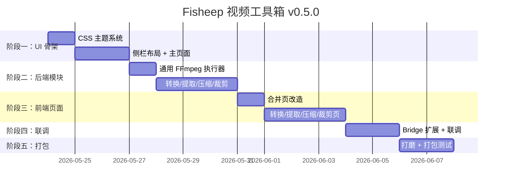

# Fisheep 视频工具箱 — v0.5.0 实施计划

## 基本信息
- **当前版本**：v0.4.0（pywebview Web UI + m4s 合并）
- **目标版本**：v0.5.0
- **迭代重心**：侧栏导航重构 + 蓝色主题 + 功能扩展为通用视频工具箱

---

## 一、核心目标

### 1. UI 重构：侧栏导航 + 蓝色主题
- 左侧固定侧栏，图标+文字导航
- 右侧为当前工具的操作区
- 暗色/亮色双主题，蓝色系主色调
- CSS 变量管理，切换 `data-theme` 属性实现无闪烁换肤

### 2. 功能扩展：5 大工具模块

| 工具 | 功能 | FFmpeg 核心命令 |
|------|------|----------------|
| 合并 | 音视频合并（保留现有 m4s + 通用格式） | `ffmpeg -i video -i audio -c copy -map 0:v -map 1:a output` |
| 转换 | 格式转换（mkv/flv/mov/avi → mp4 等） | `ffmpeg -i input -c copy output.mp4`（流复制）或重编码 |
| 提取音频 | 从视频提取 mp3/aac/flac | `ffmpeg -i input -vn -c:a libmp3lame output.mp3` |
| 压缩 | 降低码率/分辨率减小体积 | `ffmpeg -i input -c:v libx264 -crf 28 -vf scale=1280:-2 output` |
| 裁剪 | 按起止时间截取片段 | `ffmpeg -i input -ss 00:01:00 -to 00:05:00 -c copy output` |

### 3. 架构调整
- 保留 `core/` 层（scanner、matcher、merger、ffprobe）不变
- 每个工具独立一个 Python 模块 + 对应的前端页面
- bridge 层扩展，新增各工具的 API 端点

---

## 二、目录结构

```
src/fisheep_video_merger/
├── core/                          # 核心引擎（保留现有）
│   ├── scanner.py                 # 文件扫描
│   ├── matcher.py                 # m4s 配对
│   ├── merger.py                  # FFmpeg 合并
│   ├── path_utils.py              # 路径工具
│   └── converter.py               # [新增] 格式转换
│   └── extractor.py               # [新增] 音频提取
│   └── compressor.py              # [新增] 视频压缩
│   └── trimmer.py                 # [新增] 视频裁剪
├── ui/
│   ├── web/                       # Web UI
│   │   ├── index.html             # 主页面（侧栏 + 工具区）
│   │   ├── css/
│   │   │   ├── variables.css      # 主题变量（暗色/亮色 + 蓝色系）
│   │   │   ├── layout.css         # 侧栏 + 主区布局
│   │   │   ├── components.css     # 通用组件样式
│   │   │   └── animations.css     # 动效
│   │   ├── js/
│   │   │   ├── app.js             # 主逻辑 + 路由
│   │   │   ├── sidebar.js         # 侧栏导航
│   │   │   └── tools/             # 各工具前端逻辑
│   │   │       ├── merge.js
│   │   │       ├── convert.js
│   │   │       ├── extract.js
│   │   │       ├── compress.js
│   │   │       └── trim.js
│   │   └── assets/                # 图标、图片
├── utils/
│   ├── bridge.py                  # 扩展：新增各工具 API
│   ├── ffprobe.py
│   ├── logger.py
│   └── theme.py
└── main_web.py                    # 入口（pywebview）
```

---

## 三、实施阶段

### 阶段一：UI 骨架与主题系统（预计 2-3 天）

#### 1.1 CSS 变量主题系统
- [ ] 编写 `variables.css`，定义暗色/亮色两套 CSS 变量
- [ ] 主色调改为蓝色系：暗色 `#3B82F6`，亮色 `#2563EB`
- [ ] 通过 `data-theme="dark/light"` 切换

#### 1.2 侧栏导航布局
- [ ] 编写 `layout.css`，左侧 200px 固定侧栏 + 右侧弹性工作区
- [ ] 侧栏包含：logo、5 个工具图标+文字、底部设置入口
- [ ] 当前激活项高亮指示

#### 1.3 主页面 index.html
- [ ] 重构为侧栏 + 工具区结构
- [ ] 各工具区域用 `<section id="tool-xxx">` 划分，默认隐藏非活跃工具
- [ ] 保留底部全局任务状态栏

#### 1.4 路由机制
- [ ] `app.js` 实现简易 hash 路由（`#merge`、`#convert`、`#extract`、`#compress`、`#trim`、`#settings`）
- [ ] 切换工具时显示对应 section，隐藏其他

---

### 阶段二：各工具后端模块（预计 3-4 天）

#### 2.1 通用 FFmpeg 执行器
- [ ] 从 `merger.py` 中抽取 `_run_ffmpeg_with_progress` 为独立的通用执行器
- [ ] 统一进度回调接口，所有工具复用

#### 2.2 格式转换模块 `converter.py`
- [ ] `convert_single(input, output_format, progress_callback)` → `(success, error)`
- [ ] 支持流复制（同编码容器转换）和重编码（不同编码转换）
- [ ] 自动检测输入编码，智能选择是否需要重编码

#### 2.3 音频提取模块 `extractor.py`
- [ ] `extract_audio(input, output_format, progress_callback)` → `(success, error)`
- [ ] 支持 mp3 / aac / flac / wav 输出格式
- [ ] 可选码率参数（128k / 192k / 320k）

#### 2.4 视频压缩模块 `compressor.py`
- [ ] `compress_video(input, target_size_mb, progress_callback)` → `(success, error)`
- [ ] 预设：高质量 / 均衡 / 极限压缩
- [ ] 可选分辨率缩放（原始 / 1080p / 720p / 480p）

#### 2.5 视频裁剪模块 `trimmer.py`
- [ ] `trim_video(input, start_time, end_time, progress_callback)` → `(success, error)`
- [ ] 支持时间格式：`HH:MM:SS` 或秒数
- [ ] 流复制模式（快速，无损）或重编码模式（精确到帧）

---

### 阶段三：各工具前端页面（预计 3-4 天）

#### 3.1 合并工具页（改造现有）
- [ ] 移植当前合并队列 UI 到新侧栏布局
- [ ] 保留拖拽导入、智能配对、批量命名等功能
- [ ] 适配新主题色

#### 3.2 格式转换工具页
- [ ] 拖拽或选择文件
- [ ] 目标格式下拉选择（mp4 / mkv / avi / mov / webm）
- [ ] 转换模式选择（快速流复制 / 重编码）
- [ ] 任务列表 + 进度条

#### 3.3 音频提取工具页
- [ ] 拖拽或选择视频文件
- [ ] 输出格式选择（mp3 / aac / flac / wav）
- [ ] 码率选择（128k / 192k / 320k）
- [ ] 任务列表 + 进度条

#### 3.4 视频压缩工具页
- [ ] 拖拽或选择视频文件
- [ ] 压缩预设选择（高质量 / 均衡 / 极限）
- [ ] 可选分辨率缩放
- [ ] 显示预估压缩后大小
- [ ] 任务列表 + 进度条

#### 3.5 视频裁剪工具页
- [ ] 拖拽或选择视频文件
- [ ] 起止时间输入（支持手动输入 + 滑块预览）
- [ ] 裁剪模式选择（快速 / 精确）
- [ ] 任务列表 + 进度条

---

### 阶段四：Bridge 扩展与联调（预计 2 天）

#### 4.1 bridge.py 扩展
- [ ] 新增 API：`convert_file()`、`extract_audio()`、`compress_video()`、`trim_video()`
- [ ] 新增 API：`get_video_info()` — 返回视频详细信息（时长、编码、码率、分辨率）
- [ ] 统一任务队列管理，支持多工具并发

#### 4.2 前后端联调
- [ ] 各工具前端页面调用对应 bridge API
- [ ] 进度广播正常工作
- [ ] 错误处理与 toast 提示

---

### 阶段四（续）：打磨与框架迁移

#### 4.3 细节打磨 ✅
- [x] 响应式布局（窗口 < 900px 时侧栏自动折叠）
- [x] 设置页面整合（主题切换、输出目录、并发数、FFmpeg 路径）
- [x] 子标签栏美化（胶囊式标签）

#### 4.4 引入轻量前端框架
- [ ] 选型：Alpine.js（推荐，声明式 + 零构建 + 几KB）或 Preact
- [ ] 引入 UnoCSS 或 Tailwind CSS 替代手写样式
- [ ] 迁移现有 DOM 操作为组件化写法
- [ ] 全局状态管理替代当前的全局变量
- [ ] 统一设计语言（间距、圆角、阴影、动画）

---

### 阶段五：打包（预计 1 天）

#### 5.1 打包测试
- [ ] PyInstaller 打包，排除 PySide6
- [ ] 验证 exe 在干净 Windows 上运行正常
- [ ] 包体大小检查

---

## 四、里程碑时间线



---

## 五、风险与注意事项

1. **现有功能不丢失**：合并工具的核心逻辑（scanner/matcher/merger）完全保留，只改 UI 壳
2. **渐进式开发**：先做 UI 骨架 + 1 个工具（合并），跑通后再加其他工具
3. **FFmpeg 命令兼容性**：不同版本 FFmpeg 支持的参数不同，需要做降级处理
4. **大文件处理**：压缩和转换可能很慢，需要完善的进度反馈和取消机制

---

## 六、v0.5.1 Bug 清单

| # | 严重度 | 文件 | 问题 |
|---|--------|------|------|
| 1 | Warning | WebView2 | WebView2 `file://` 协议下无法复制文字（clipboard API 受限） |
| 2 | Warning | app.js | 非合并工具的拖拽导入不生效（pywebview 文件路径获取限制） |
| 3 | Warning | merger.py | MergeWorker `os.path.exists` 检查存在 TOCTOU 竞态 |
| 4 | Minor | matcher.py | NvN 匹配假设音视频文件字母序一致，可能配错对 |
| 5 | Minor | main_window.py | `_on_ctrl_f` 调用子组件私有方法 `_on_selection_changed` |
